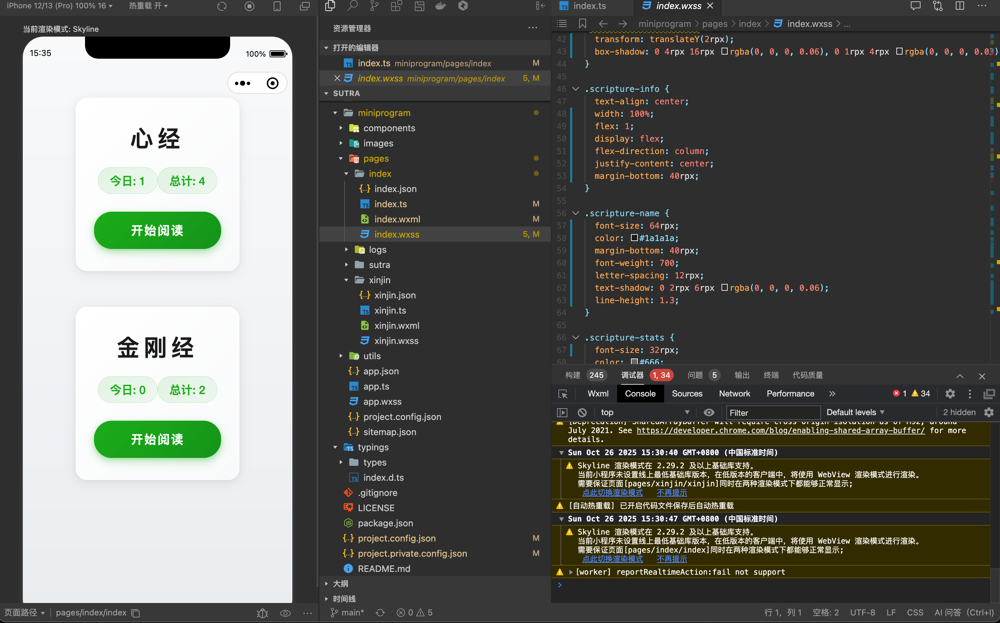

# 诵经小程序

一个帮助用户记录每日诵经功课的微信小程序。

## 预览



_注：需要在 miniprogram/images/preview 目录下添加首页截图_

## 功能特点

- 支持心经和金刚经的每日诵读记录
- 统计每日诵经次数和总计数据
- 优雅的用户界面设计
- 支持微信登录

## 开发环境

- 微信开发者工具
- TypeScript
- WeUI 组件库

## 快速开始

1. 克隆仓库
```bash
git clone https://github.com/yourusername/sutra.git
```

2. 在微信开发者工具中打开项目

3. 在 project.config.json 中配置你的 AppID

## 项目结构

```
sutra/
├── miniprogram/          # 小程序源码
│   ├── components/       # 自定义组件
│   ├── images/          # 图片资源
│   ├── pages/           # 页面文件
│   └── app.*            # 应用入口文件
├── typings/             # TypeScript 类型定义
└── project.config.json  # 项目配置文件
```

## 贡献指南

欢迎提交 Pull Request 或 Issue。

## 许可证

MIT License
